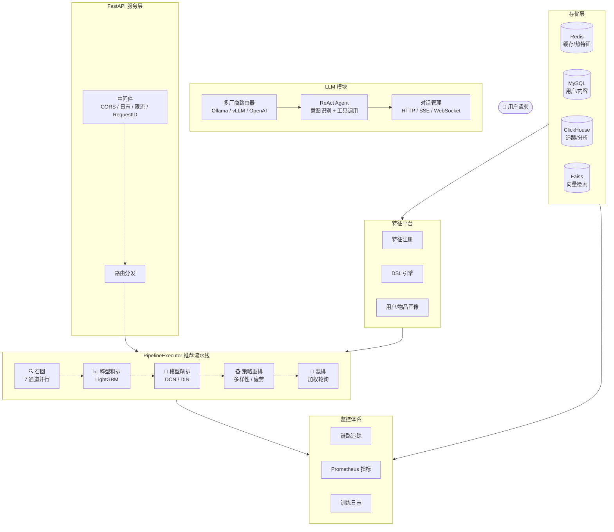

# LLM-Rec-Platform

**融合大语言模型的智能推荐系统平台** — 面向 10万-100万 用户规模，支持内容推荐 + 社交属性的个性化推荐场景。

---

## Highlights

- **LLM-native 推荐架构** — 大语言模型深度融入推荐链路：语义 Embedding、新内容冷启动模拟、搜索结果个性化摘要
- **对话式链路控制** — 自然语言对话实时控制推荐策略，支持「关闭热门召回」「调权重」「分析推荐结果」等指令
- **5 级推荐漏斗** — 多路召回 → 稡型粗排 → DNN 稡型精排 → 策略重排 → 混排
- **LLM 多厂商路由** — 支持 Ollama/vLLM/OpenAI/Triton，优先级自动降级
- **A/B 实验框架** — 确定性哈希分桶、多层实验、实时指标收集
- **全链路追踪** — PipelineTrace 贔穿每个请求各阶段，异步训练日志落盘
- **配置图驱动** — 图依赖解析 + 拓扑排序 + 环境覆盖，一套配置管理全环境

---

## Architecture



---

## Tech Stack

| 类别 | 技术 |
|------|------|
| 后端框架 | Python FastAPI + Uvicorn |
| LLM 推理 | vLLM / Ollama / OpenAI（OpenAI 兼容协议） |
| LLM Agent | ReAct Agent（自研框架） |
| 深度学习 | PyTorch（TwoTower / DCN-v2 / DIN） |
| 树模型 | LightGBM |
| 向量检索 | Faiss |
| 缓存 | Redis |
| OLAP | ClickHouse |
| 关系数据库 | MySQL |
| 监控 | Grafana + Prometheus |
| 容器化 | Docker Compose |

---

## Project Structure

```
llm-rec-platform/
├── configs/              # 配置中心（图依赖 + 拓扑排序 + 环境覆盖）
├── protocols/            # 协议定义（Protobuf + Pydantic Schema）
├── server/               # FastAPI 服务（中间件 + 路由 + WebSocket Chat）
├── pipeline/             # 推荐链路核心（召回/排序/场景）
├── llm/                  # LLM 融合（后端/Agent/对话界面/任务/Prompt）
├── feature/              # 特征平台（注册/存储/DSL引擎/画像）
├── monitor/              # 监控体系（链路追踪/指标/训练日志落盘）
├── storage/              # 存储后端封装（Redis/MySQL/ClickHouse/Faiss）
├── experiment/            # A/B 实验框架
├── scripts/              # 训练/离线脚本
├── docker/               # Docker Compose 编排
├── docs/                 # 技术文档（MkDocs + Material）
└── tests/                # 单元/集成/E2E 测试
```

---

## API Endpoints

| 方法 | 路径 | 说明 |
|------|------|------|
| POST | `/api/recommend` | 推荐请求 |
| POST | `/api/search` | 搜索推荐（LLM 摘要） |
| POST | `/api/chat` | HTTP 对话 |
| POST | `/api/chat/stream` | SSE 流式对话 |
| WS | `/api/ws/chat` | WebSocket 对话 |
| POST | `/api/track` | 行为追踪 |
| GET | `/api/social/{user_id}` | 社交图谱 |
| POST | `/api/social/follow` | 关注用户 |
| GET | `/api/health` | 健康检查 |
| GET | `/api/metrics` | Prometheus 指标 |
| GET | `/api/experiments` | 实验列表 |
| POST | `/api/experiments` | 创建实验 |
| GET | `/api/llm/status` | LLM Provider 状态 |
| POST | `/api/llm/select/{name}` | 切换 Provider |

---

## Roadmap

| Phase | 内容 | 状态 |
|-------|------|------|
| Phase 1 | 项目骨架 + 配置中心 + 协议定义 | ✅ Done |
| Phase 2 | 推荐链路（召回 → 排序 → 混排） | ✅ Done |
| Phase 3 | 特征平台 + 用户/物品画像 | ✅ Done |
| Phase 4 | LLM 融合（Embedding / 内容生成 / 对话式 Agent） | ✅ Done |
| Phase 5 | 监控体系 + 链路追踪 + 日志落盘 | ✅ Done |
| Phase 6 | 模型训练闭环 + A/B 测试 + 部署 | ✅ Done |
| Phase 7 | 技术文档（MkDocs + 浏览器查看） | ✅ Done |

---

## Quick Start

```bash
# 1. 安装依赖
pip install -e ".[dev]"

# 2. 启动服务（开发模式）
APP_ENV=development python -m uvicorn server.app:create_app --factory --reload --port 8000

# 3. 健康检查
curl http://localhost:8000/api/health

# 4. 推荐请求
curl -X POST http://localhost:8000/api/recommend \
  -H "Content-Type: application/json" \
  -d '{"user_id": "u123", "scene": "home_feed", "num": 10}'

# 5. LLM Agent 对话
curl -X POST http://localhost:8000/api/chat \
  -H "Content-Type: application/json" \
  -d '{"user_id": "admin", "message": "关闭热门召回通道"}'
```

### Docker Compose（完整服务栈）

```bash
cd docker
docker-compose up -d                    # Redis + MySQL + ClickHouse + Prometheus + Grafana + 推荐服务
docker-compose --profile gpu up -d      # 含 GPU LLM（vLLM）
```

### 运行测试

```bash
pytest tests/                        # 全部测试
pytest tests/unit/                    # 单元测试
pytest tests/integration/             # 集成测试
```

---

## 技术文档

完整技术文档支持本地浏览器查看（MkDocs + Material 主题）：

```bash
# 安装文档依赖
pip install mkdocs mkdocs-material mkdocs-mermaid2-plugin

# 本地预览（热更新）
cd /path/to/llm-rec-platform
python -m mkdocs serve -a localhost:8001

# 构建静态站点
python -m mkdocs build
```

打开 http://localhost:8001 查看，包含 43 页文档、13 张架构图、暗色模式、中文搜索。

---

## Performance Targets

| 指标 | 目标值 |
|------|--------|
| 推荐延迟 (P99) | < 200ms |
| 并发 QPS | ≥ 1000 |
| 召回覆盖率 | ≥ 85% |
| 服务可用性 | ≥ 99.9% |

---

## TODO

### P2 — 性能优化

- [ ] 推荐链路推理性能优化 — 召回通道并行化、batch 推理、TensorRT/ONNX 加速、特征预取缓存
- [ ] 召回通道并行化 — `RecallMerger` 串行改 `asyncio.gather` 并行

### P2 — 功能补全

- [ ] DSL 引擎函数补全 — 补齐 if/case/sum/avg/max/min/dot/cosine_sim/split/contains/len
- [ ] 多轮对话上下文管理 — Chat 会话上下文记忆和多轮追问
- [ ] RAG 知识库 — Agent 基于运维文档检索回答问题
- [ ] Agent 更多工具 — 日志分析、异常检测、模型性能对比

### P3 — 代码质量

- [ ] `__init__.py` 导出优化 — 51 个空文件补充 re-export
- [ ] 静默异常改进 — `except Exception: pass` 加 debug 日志

### P4 — 新系统开发

- [ ] C++ ONNX 模型部署优化 — C++ + ONNX Runtime 重写排序推理服务，提升吞吐
- [ ] 前端推荐 APP — 类似小红书的视频/图文推荐 APP，瀑布流 Feed + 交互
- [ ] 内容抓取供给系统 — 自动化内容采集管道，抓取/清洗/入库/去重/标签提取

---

## License

MIT
