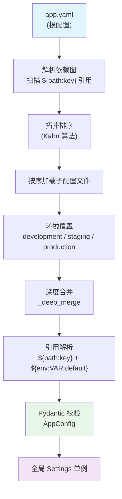
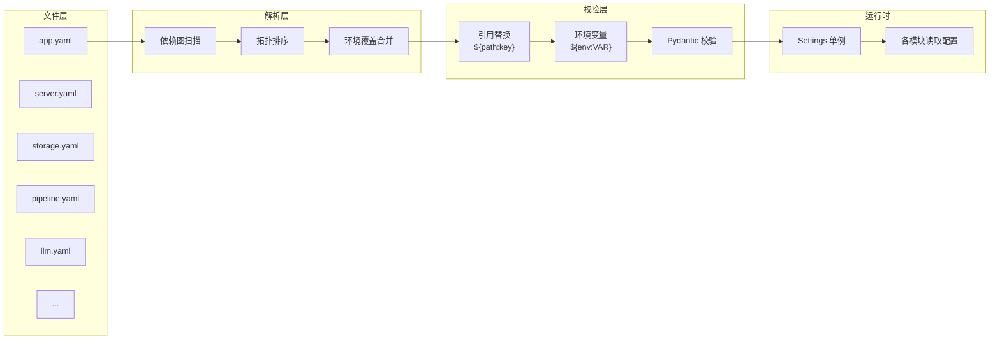

# 配置系统原理

配置系统是推荐平台的基座模块，负责从 YAML 文件加载配置、解析跨文件引用、环境覆盖和类型校验。

## 配置加载管线



### 加载流程详解

| 步骤 | 说明 | 实现 |
|------|------|------|
| 1. 加载 app.yaml | 读取根配置文件，扫描所有 `${path:key}` 引用 | `ConfigLoader.load()` |
| 2. 依赖图构建 | 递归扫描配置值，构建文件间依赖关系 | `_scan_deps()` |
| 3. 拓扑排序 | 使用 Kahn 算法确定加载顺序，检测循环依赖 | `resolve_dep_graph()` |
| 4. 环境覆盖 | 根据 `APP_ENV` 加载对应环境配置，深度合并 | `_deep_merge()` |
| 5. 引用解析 | 递归替换所有 `${path:key}` 和 `${env:VAR:default}` | `_resolve_refs()` |
| 6. Pydantic 校验 | 用类型安全的模型验证配置完整性 | `validate_config()` |
| 7. 全局单例 | 通过 `get_settings()` 提供全局访问 | `_Settings` |

## 引用语法

### 跨文件引用

```
${path/to/file.yaml:key.nested.key}
```

在 `app.yaml` 中引用子配置文件的值：

```yaml
# configs/app.yaml
server:
  host: ${server/server.yaml:host}
  port: ${server/server.yaml:port}

storage:
  redis: ${storage/storage.yaml:redis}
  mysql: ${storage/storage.yaml:mysql}
```

加载器会：

1. 读取 `configs/server/server.yaml` 文件
2. 从中提取 `host` 字段的值
3. 替换 `app.yaml` 中的引用

### 环境变量引用

```
${env:VAR_NAME:default_value}
```

在配置文件中引用环境变量，支持默认值：

```yaml
# configs/storage/storage.yaml
redis:
  host: "${env:REDIS_HOST:localhost}"     # 读取 REDIS_HOST，默认 localhost

mysql:
  host: "${env:MYSQL_HOST:localhost}"     # 读取 MYSQL_HOST，默认 localhost

clickhouse:
  host: "${env:CLICKHOUSE_HOST:localhost}"
```

```yaml
# configs/llm/llm.yaml
providers:
  - name: "openai"
    api_key: "${env:GLM_API_KEY:}"        # 读取 API Key，默认为空
```

## 依赖图与拓扑排序

### 依赖图解析

`_scan_deps()` 递归扫描配置数据，发现所有 `${path:key}` 引用，构建依赖关系图：

```
app.yaml
├── server → server/server.yaml
├── storage → storage/storage.yaml
├── models → model/models.yaml
├── pipeline → pipeline/pipeline.yaml, pipeline/recall.yaml, pipeline/ranking.yaml
├── features → feature/features.yaml
├── llm → llm/llm.yaml
├── experiment → experiment/experiments.yaml
└── monitor → monitor/monitor.yaml
```

### Kahn 算法拓扑排序

```python
def resolve_dep_graph(app_config):
    deps = {}                    # {节点: {依赖集合}}
    _scan_deps(app_config, "", deps)

    # 计算入度
    in_degree = {k: 0 for k in deps}
    for node, parents in deps.items():
        for p in parents:
            in_degree[node] += 1

    # 入度为 0 的入队
    queue = [n for n, d in in_degree.items() if d == 0]
    order = []

    while queue:
        node = queue.pop(0)
        order.append(node)
        for child, parents in deps.items():
            if node in parents:
                in_degree[child] -= 1
                if in_degree[child] == 0:
                    queue.append(child)

    # 检测循环
    if len(order) < len(in_degree):
        raise ConfigLoadError("配置依赖存在循环引用")

    return [CONFIG_ROOT / p for p in order if (CONFIG_ROOT / p).exists()]
```

## 环境覆盖

根据 `APP_ENV` 环境变量加载对应的覆盖配置：

| 环境变量值 | 覆盖文件 | 说明 |
|-----------|---------|------|
| `development` | `configs/environments/development.yaml` | 本地开发环境 |
| `staging` | `configs/environments/staging.yaml` | 预发布环境 |
| `production` | `configs/environments/production.yaml` | 生产环境 |

### 覆盖规则

使用 `_deep_merge()` 深度合并：环境配置覆盖基础配置，嵌套字典递归合并。

```python
def _deep_merge(base: dict, override: dict) -> dict:
    result = base.copy()
    for k, v in override.items():
        if k in result and isinstance(result[k], dict) and isinstance(v, dict):
            result[k] = _deep_merge(result[k], v)  # 递归合并
        else:
            result[k] = v  # 直接覆盖
    return result
```

## Pydantic 校验

合并后的原始字典通过 `validate_config()` 转换为类型安全的 `AppConfig` 对象：

```python
class AppConfig(BaseModel):
    server: ServerConfig
    storage: StorageConfig
    models: dict[str, ModelConfig]
    pipeline: dict[str, Any]
    features: dict[str, Any]
    llm: LLMConfig
    monitor: MonitorConfig
    experiment: ExperimentConfig
```

校验失败时会抛出 `ValidationError`，防止非法配置进入运行时。

## 全局访问

```python
from configs.settings import get_settings

settings = get_settings()

# 属性访问（类型安全）
settings.server.host       # str
settings.storage.redis     # RedisConfig
settings.llm               # LLMConfig

# 点号路径访问（灵活）
settings.get("storage.redis.host")           # "localhost"
settings.get("llm.providers.0.base_url")     # URL
settings.get("nonexistent", "default")        # "default"
```

`_Settings` 单例延迟初始化，首次访问时自动加载配置。

## 配置文件清单

| 文件路径 | 说明 | 关键配置项 |
|----------|------|-----------|
| `configs/app.yaml` | 根配置入口 | 通过引用组装所有子配置 |
| `configs/server/server.yaml` | 服务配置 | host, port, workers, log_level |
| `configs/storage/storage.yaml` | 存储配置 | Redis, MySQL, ClickHouse 连接参数 |
| `configs/model/models.yaml` | 模型配置 | TwoTower, DCN, DIN, LightGBM 模型参数 |
| `configs/pipeline/pipeline.yaml` | 链路配置 | 推荐阶段定义和超时 |
| `configs/pipeline/recall.yaml` | 召回配置 | 召回通道列表、权重、参数 |
| `configs/pipeline/ranking.yaml` | 排序配置 | 排序模型和策略 |
| `configs/feature/features.yaml` | 特征配置 | 特征注册表 |
| `configs/llm/llm.yaml` | LLM 配置 | 多厂商 provider 列表、路由策略 |
| `configs/experiment/experiments.yaml` | 实验配置 | A/B 实验定义 |
| `configs/monitor/monitor.yaml` | 监控配置 | Sink 列表、指标定义 |
| `configs/environments/*.yaml` | 环境覆盖 | development / staging / production |

## 配置加载完整流程图


