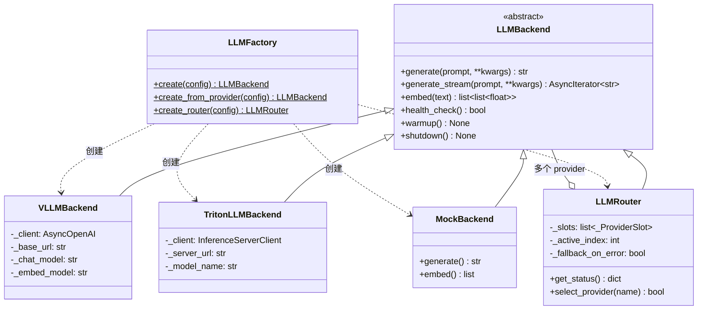
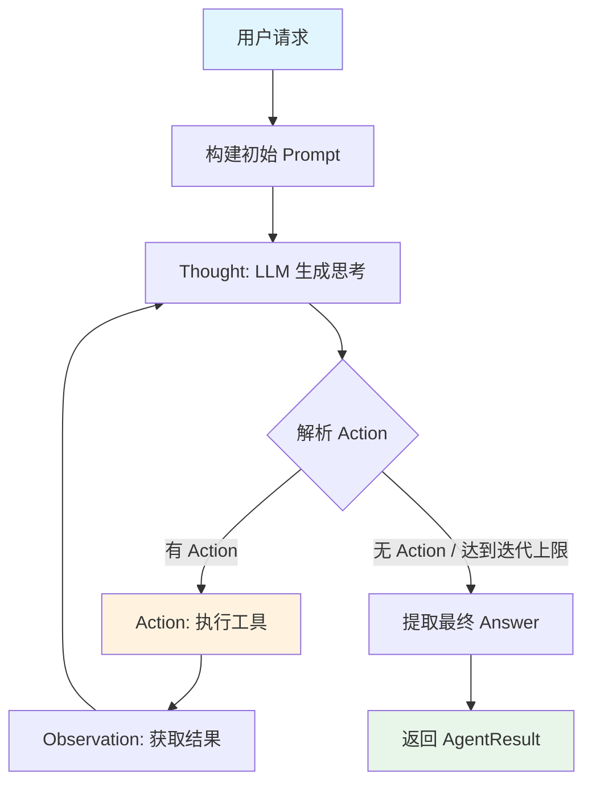
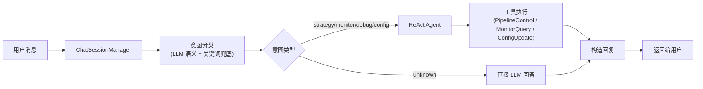

# LLM 模块架构

LLM 模块是推荐平台的核心智能化组件，负责大语言模型调用、多厂商路由、Agent 工具调用、对话管理和 Prompt 模板管理。

## 模块架构总览



### 核心组件

| 组件 | 文件路径 | 职责 |
|------|---------|------|
| `LLMBackend` | `llm/base.py` | 抽象基类，定义统一接口 |
| `VLLMBackend` | `llm/backends/vllm_backend.py` | OpenAI 兼容协议后端 |
| `TritonLLMBackend` | `llm/backends/triton_backend.py` | NVIDIA Triton 后端 |
| `MockBackend` | `llm/backends/mock_backend.py` | 测试用 Mock 后端 |
| `LLMRouter` | `llm/router.py` | 多厂商路由与自动降级 |
| `LLMFactory` | `llm/factory.py` | 后端实例工厂 |

## 多厂商路由

`LLMRouter` 实现了 `LLMBackend` 接口，对下游完全透明，支持多 LLM 厂商的优先级调度和自动降级。

### 路由策略

```yaml
# configs/llm/llm.yaml
providers:
  - name: "openai"
    priority: 1            # 优先级，数字越小越优先
  - name: "ollama"
    priority: 2
  - name: "vllm"
    priority: 2

routing:
  strategy: "priority"     # 基于优先级
  health_check_interval: 60  # 健康检查间隔（秒）
  fallback_on_error: true    # 请求失败时自动降级
```

### 工作流程

1. **初始化**：`LLMRouter.warmup()` 按 priority 排序所有 provider，选择第一个可用的作为活跃后端
2. **请求调度**：调用 `generate()` / `embed()` 时，先尝试活跃后端
3. **自动降级**：活跃后端请求失败时，自动标记为不可用，切换到下一个可用后端
4. **健康恢复**：后台定时任务 `_periodic_health_check()` 对不可用的 provider 执行健康检查，恢复后标记为可用
5. **手动切换**：通过 `select_provider(name)` 或 API 手动切换活跃 provider

### 健康检查恢复机制

```python
# 后台健康检查循环
async def _periodic_health_check(self):
    while True:
        await asyncio.sleep(self._health_check_interval)  # 默认 60s
        for slot in self._slots:
            if not slot.available:
                ok = await slot.backend.health_check()
                if ok:
                    slot.available = True  # 恢复可用
```

## Agent 框架

Agent 框架实现了 ReAct（Reasoning + Acting）模式，通过 Thought-Action-Observation 循环完成复杂任务。

### ReAct 循环



### 内置工具

Agent 配备了 3 个工具，覆盖链路控制、监控查询和配置管理：

| 工具 | 类名 | 功能 | 参数 |
|------|------|------|------|
| `pipeline_control` | `PipelineControlTool` | 管理召回通道开关和权重 | `action`, `channel`, `weight` |
| `monitor_query` | `MonitorQueryTool` | 查询延迟、QPS、召回覆盖率 | `metric`, `time_range` |
| `config_update` | `ConfigUpdateTool` | 运行时配置热更新 | `key`, `value` |

#### PipelineControlTool 支持的操作

| action | 说明 | 示例 |
|--------|------|------|
| `enable` | 启用召回通道 | `{"action": "enable", "channel": "social"}` |
| `disable` | 禁用召回通道 | `{"action": "disable", "channel": "cold_start"}` |
| `set_weight` | 调整通道权重 | `{"action": "set_weight", "channel": "personalized", "weight": 0.4}` |
| `list` | 列出所有通道状态 | `{"action": "list"}` |

#### 默认通道权重分配

| 通道 | 默认权重 | 说明 |
|------|---------|------|
| `personalized` | 0.30 | 个性化召回 |
| `collaborative` | 0.20 | 协同过滤召回 |
| `social` | 0.15 | 社交关系召回 |
| `community` | 0.10 | 社区召回 |
| `hot` | 0.10 | 热门召回 |
| `operator` | 0.05 | 运营人工召回 |
| `cold_start` | 0.10 | 冷启动召回 |

## 对话系统

### 架构流程



### 意图分类

系统采用二级意图识别策略：

1. **LLM 语义识别**（优先）：调用 LLM 解析用户消息，返回意图类型、置信度和原因
2. **关键词匹配**（兜底）：当 LLM 不可用时，基于关键词表匹配

| 意图类型 | 说明 | 匹配关键词示例 |
|----------|------|---------------|
| `strategy` | 策略控制 | 关闭、启用、调整、权重、召回、排序、切换 |
| `monitor` | 监控查询 | 延迟、P99、QPS、覆盖率、指标、性能 |
| `debug` | 调试诊断 | 分析、为什么、偏少、推荐结果、诊断 |
| `config` | 配置管理 | 配置、版本、回滚、实验、A/B、参数 |
| `unknown` | 未识别 | — （直接用 LLM 回答） |

### 会话管理

`ChatSessionManager` 管理对话会话的生命周期：

- **会话创建**：`create_session(user_id)` 生成唯一 `session_id`
- **会话获取**：`get_session(session_id)` 自动检查过期（默认 TTL 3600 秒）
- **过期清理**：`cleanup_expired_sessions()` 清理过期会话
- **容量限制**：最大会话数 1000，超出时淘汰最旧会话

## Prompt 管理

### PromptManager

`PromptManager`（`llm/prompt/manager.py`）负责模板加载、缓存和渲染：

```python
# 全局单例
pm = get_prompt_manager()

# 渲染模板（{{variable}} 变量替换）
prompt = pm.render("executor", user_request="查看延迟", tools=tools_desc)

# 注册内存模板
pm.register("custom_template", "自定义内容: {{var}}")

# 列出所有可用模板
templates = pm.list_templates()
```

### 模板文件清单

模板文件位于 `llm/prompt/templates/` 目录：

| 模板文件 | 用途 |
|----------|------|
| `executor.txt` | ReAct Agent 初始 Prompt |
| `intent_classify.txt` | 意图分类 Prompt |
| `chat_assistant.txt` | 通用对话助手 Prompt |
| `content_gen.txt` | 内容模拟生成 Prompt |
| `query_expand.txt` | 搜索 Query 扩展 Prompt |
| `rerank_summary.txt` | 搜索摘要重排 Prompt |
| `critic.txt` | Agent 反思评估 Prompt |
| `planner.txt` | Agent 规划 Prompt |
| `monitor_agent.txt` | 监控 Agent Prompt |

## LLM 任务模块

`llm/tasks/` 目录下包含基于 LLM 的具体任务实现：

| 任务 | 类名 | 功能 |
|------|------|------|
| Embedding 生成 | `Embedder` | 单条/批量文本 embedding，物品语义 embedding |
| 内容生成 | `ContentGenerator` | 冷启动模拟交互数据生成 |
| 语义搜索 | `SemanticSearch` | Query 扩展 + 向量检索 + 语义重排 |
| 重排摘要 | `RerankSummary` | 基于用户兴趣生成个性化搜索摘要 |

### Embedder

```python
embedder = Embedder(llm_backend)

# 单条文本 embedding
emb = await embedder.embed_text("推荐系统入门教程")

# 物品语义 embedding（标题 + 标签 + 描述）
emb = await embedder.embed_item("item_001", "Python 入门", ["编程", "教程"])

# 批量 embedding（自动分 batch）
embs = await embedder.embed_batch(texts, batch_size=32)
```

### SemanticSearch

语义搜索完整流程：Query 扩展 -> 向量检索 -> 结果排序

```python
search = SemanticSearch(llm_backend)
results = await search.semantic_search("机器学习", faiss_store=store, top_k=50)
```

### ContentGenerator

为冷启动内容生成模拟交互数据：

```python
gen = ContentGenerator(llm_backend)
sim = await gen.generate_simulated_interactions(
    title="新文章标题", tags=["AI", "推荐"], author="张三"
)
```

### RerankSummary

基于用户兴趣生成个性化搜索摘要：

```python
rs = RerankSummary(llm_backend)
summary = await rs.generate_summary(
    query="机器学习",
    content="文章正文...",
    user_interests=["AI", "Python", "数据科学"]
)
```
