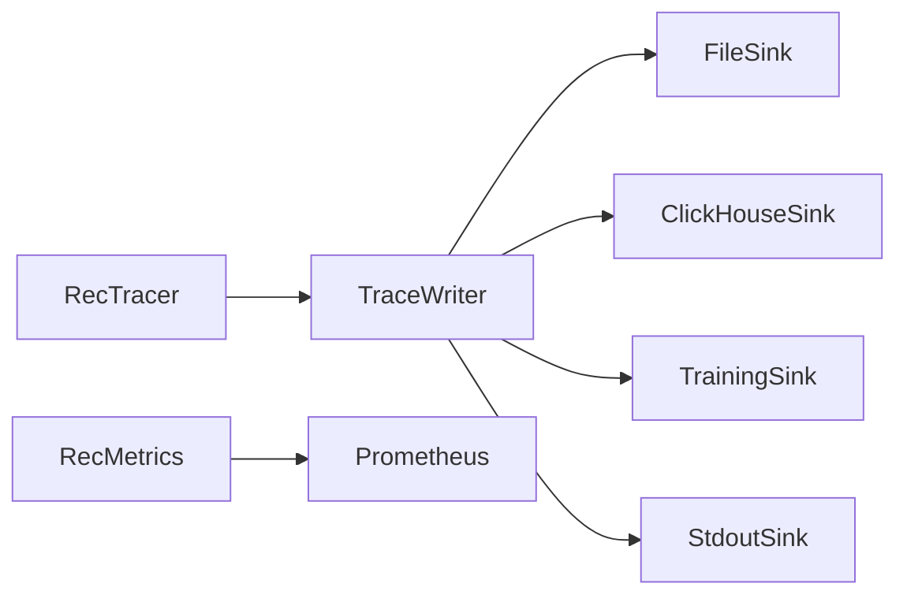

# 监控追踪体系

## 数据流



## 三层监控

| 组件 | 职责 | 位置 |
|------|------|------|
| **RecTracer** | 记录每阶段延迟、每物品各阶段得分 | `monitor/tracer.py` |
| **RecMetrics** | Prometheus 指标（延迟 histogram、QPS counter） | `monitor/metrics.py` |
| **TrainingLogger** | 异步 JSONL 训练日志 + 标签回填 | `monitor/training_logger.py` |

## 追踪数据结构

```python
@dataclass
class StageTrace:
    stage_name: str
    latency_ms: float
    input_count: int
    output_count: int

@dataclass
class PipelineTrace:
    request_id: str
    user_id: str
    stages: list[StageTrace]
    item_traces: dict[str, dict[str, float]]  # item_id → {stage: score}
    total_latency_ms: float
```

## Sink 配置

```yaml
# configs/monitor/monitor.yaml
enabled: true
sinks:
  - type: file
    path: "data/traces"
    rotation: daily
  - type: clickhouse
    table: rec_traces
  - type: stdout

metrics:
  latency_buckets: [10, 50, 100, 200, 500, 1000]
  namespace: rec_platform
```

## 使用方式

```python
from monitor.collector import MonitorCollector

collector = MonitorCollector(sinks=[file_sink, ch_sink])
# 每个 request 自动记录到 tracer
# async 写入 sink
# 行为追踪触发训练标签回填
```

## 访问指标

- Prometheus: `GET /api/metrics`（文本格式）
- Grafana: `http://localhost:3000`（预配置 Dashboard）
