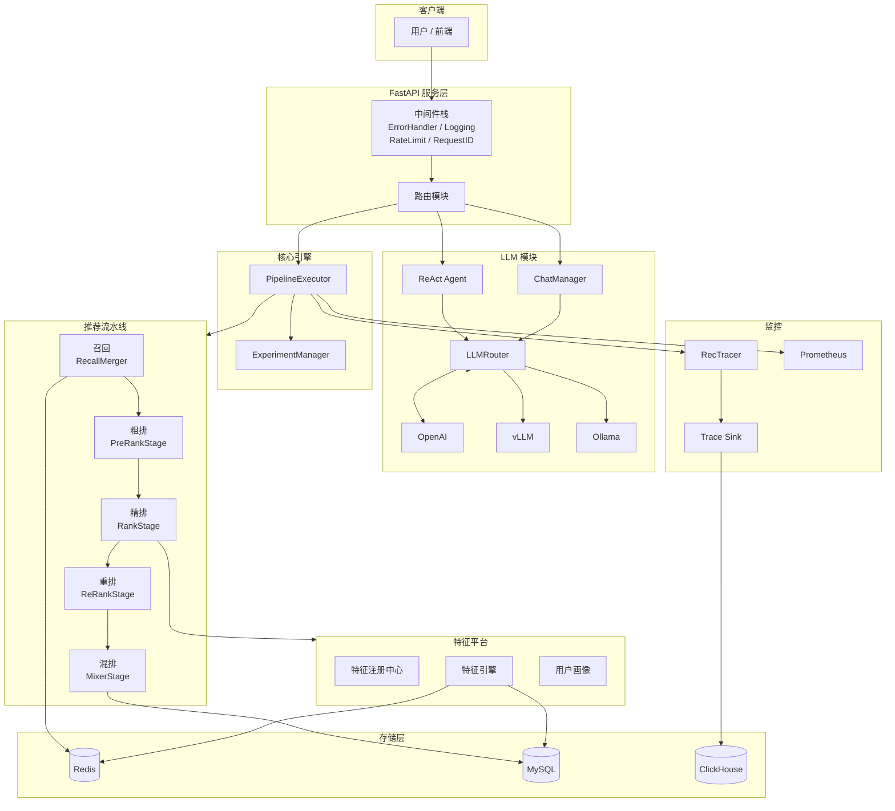
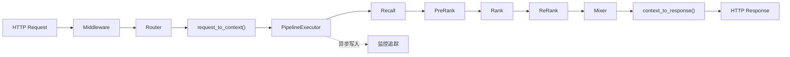
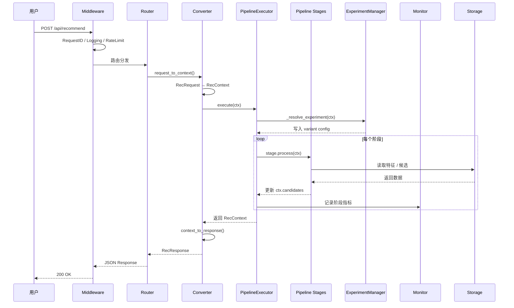

# 系统总览

本文档介绍 LLM 推荐系统平台的高层架构设计，包括模块关系、数据流、核心设计原则和请求生命周期。

## 高层架构



## 数据流



核心数据转换流程：

1. **HTTP Request** 通过中间件栈（错误处理、日志、限流、RequestID）
2. **路由分发**到对应 handler（`/api/recommend`, `/api/chat` 等）
3. **协议层转换**：`request_to_context()` 将 HTTP Schema 转为内部 `RecContext`
4. **PipelineExecutor** 按配置顺序执行 5 级流水线
5. **协议层转换**：`context_to_response()` 将 `RecContext` 转为 HTTP Response
6. **异步监控**：链路追踪数据写入 ClickHouse，指标推送到 Prometheus

## 模块职责

| 模块 | 路径 | 职责 |
|------|------|------|
| **Server** | `server/` | FastAPI 应用工厂、路由注册、中间件、生命周期管理 |
| **Pipeline** | `pipeline/` | 推荐流水线执行器、5 级漏斗（召回/粗排/精排/重排/混排） |
| **LLM** | `llm/` | 多厂商 LLM 路由、Agent 框架、对话系统、Prompt 管理 |
| **Feature** | `feature/` | 特征注册中心、在线/离线特征引擎、用户画像 |
| **Experiment** | `experiment/` | A/B 实验管理、流量分流、变体配置覆盖 |
| **Monitor** | `monitor/` | 全链路追踪（RecTracer）、Prometheus 指标、训练日志 |
| **Storage** | `storage/` | Redis / MySQL / ClickHouse 存储后端封装 |
| **Protocols** | `protocols/` | 请求/响应 Schema、RecContext、协议层转换器 |
| **Configs** | `configs/` | YAML 配置图、环境覆盖、配置校验 |

## 设计原则

### 模块化

每个模块独立目录，通过抽象接口（`PipelineStage`, `LLMBackend`）解耦。模块间通过 `RecContext` 传递数据，无直接依赖。

### 配置驱动

所有运行时行为通过 YAML 配置文件控制：

```yaml
# configs/pipeline/pipeline.yaml — 配置驱动加载阶段
stages:
  - name: "recall"
    class: "pipeline.recall.merger.RecallMerger"
    timeout_ms: 50
  - name: "prerank"
    class: "pipeline.ranking.prerank.PreRankStage"
    timeout_ms: 10
  # ...
```

新增阶段只需编写类 + 添加配置，无需修改启动代码。

### 优雅降级

任何组件初始化失败不会导致服务崩溃：

- **存储连接失败** — 降级运行，日志警告
- **LLM 后端不可用** — 自动切换到 Mock 后端
- **单阶段异常** — 标记 `ctx.degraded`，跳过该阶段继续执行
- **实验框架失败** — 使用默认配置

### 协议抽象

内部使用 `RecContext` 统一数据模型，HTTP/gRPC 协议通过转换器隔离：

```
HTTP Request  → request_to_context() → RecContext → Pipeline → RecContext → context_to_response() → HTTP Response
```

### 实验集成

ExperimentManager 在 Pipeline 执行前解析用户分流，将变体配置写入 `RecContext`。后续阶段可读取 `ctx.experiment_overrides` 调整行为。

### LLM-Native

LLM 不是独立服务，而是深度集成到推荐系统中：

- **Agent 运维** — 自然语言控制推荐策略
- **对话系统** — SSE/WebSocket 实时交互
- **多厂商路由** — Priority 排序 + 自动 Fallback
- **模型服务** — 未来支持 LLM-based 重排和摘要生成

## 请求生命周期



## 下一步

- [推荐流水线](pipeline.md) — 5 级漏斗的详细设计和类图
