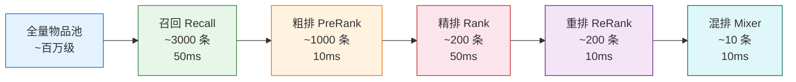
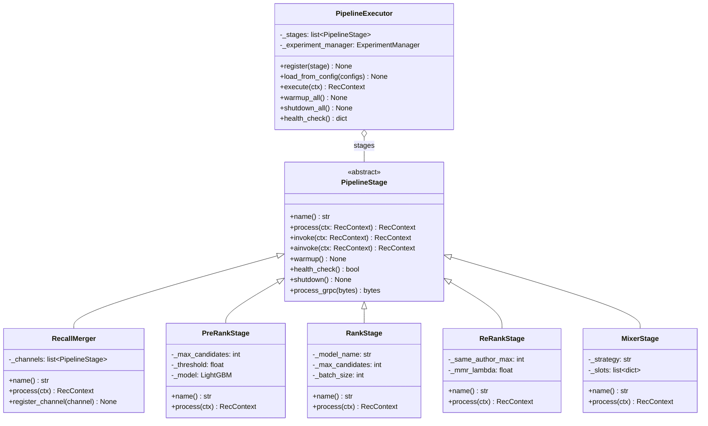

# 推荐流水线架构

推荐流水线是平台的核心，采用 5 级漏斗设计，从海量候选中逐级筛选出最终推荐结果。所有阶段通过 `PipelineStage` 抽象接口统一，由 `PipelineExecutor` 配置驱动执行。

## 5 级漏斗概览



各级数量和延迟来自 `configs/pipeline/pipeline.yaml` 中的配置默认值。

## 类图



## 配置驱动加载

流水线阶段通过 `configs/pipeline/pipeline.yaml` 声明式配置：

```yaml
# configs/pipeline/pipeline.yaml
stages:
  - name: "recall"
    class: "pipeline.recall.merger.RecallMerger"
    timeout_ms: 50

  - name: "prerank"
    class: "pipeline.ranking.prerank.PreRankStage"
    timeout_ms: 10

  - name: "rank"
    class: "pipeline.ranking.rank.RankStage"
    timeout_ms: 50

  - name: "rerank"
    class: "pipeline.ranking.rerank.ReRankStage"
    timeout_ms: 10

  - name: "mixer"
    class: "pipeline.ranking.mixer.MixerStage"
    timeout_ms: 10
```

`PipelineExecutor.load_from_config()` 通过 `importlib` 动态加载每个阶段类并实例化。新增阶段只需：

1. 实现 `PipelineStage` 接口
2. 在 `pipeline.yaml` 中添加配置项

无需修改任何启动或注册代码。

## 各阶段详解

### 1. 召回 (Recall)

| 属性 | 说明 |
|------|------|
| **输入** | `RecContext`（user_id, scene） |
| **输出** | ~3000 条候选物品 |
| **超时** | 50ms |
| **模型** | Faiss IVF 向量检索、协同过滤 |

RecallMerger 管理多个召回通道，通过 `asyncio.gather` 并行执行：

| 通道 | 类 | 权重 | Top-K |
|------|-----|------|-------|
| personalized | `PersonalizedRecall` | 0.30 | 500 |
| collaborative | `CollaborativeRecall` | 0.20 | 300 |
| social | `SocialRecall` | 0.15 | 200 |
| community | `CommunityRecall` | 0.10 | 200 |
| hot | `HotRecall` | 0.10 | 200 |
| cold_start | `ColdStartRecall` | 0.10 | 200 |
| operator | `OperatorRecall` | 0.05 | 50 |

各通道从 `configs/pipeline/recall.yaml` 加载配置。合并后按 `item_id` 去重，按分数排序。

### 2. 粗排 (PreRank)

| 属性 | 说明 |
|------|------|
| **输入** | ~3000 条候选 |
| **输出** | ~1000 条候选 |
| **超时** | 10ms |
| **模型** | LightGBM |

使用 LightGBM 快速打分，提取用户特征 + 物品特征 + 上下文特征的拼接作为输入。低于 `score_threshold` 的物品被过滤，保留 top 1000。

### 3. 精排 (Rank)

| 属性 | 说明 |
|------|------|
| **输入** | ~1000 条候选 |
| **输出** | ~200 条候选 |
| **超时** | 50ms |
| **模型** | DNN（默认 DCN） |

精排模型使用更丰富的交叉特征（用户 embedding 与物品 embedding 的余弦相似度），分 batch 推理（batch_size=64），保留 top 200。

### 4. 重排 (ReRank)

| 属性 | 说明 |
|------|------|
| **输入** | ~200 条候选 |
| **输出** | ~200 条候选（重排序） |
| **超时** | 10ms |
| **策略** | MMR 多样性 + 疲劳控制 + 业务加权 |

重排阶段应用业务规则：

1. **业务加权** — 关注作者内容加权 1.1x，新内容加权 1.2x
2. **疲劳控制** — 过滤最近已曝光物品
3. **多样性打散** — MMR 策略，限制同作者最多 2 条、同标签最多 3 条

### 5. 混排 (Mixer)

| 属性 | 说明 |
|------|------|
| **输入** | ~200 条候选 |
| **输出** | ~10 条（按 `num` 参数） |
| **超时** | 10ms |
| **策略** | 加权轮询（Weighted Round Robin） |

按内容类型比例分配位置，默认比例：

| 内容类型 | 比例 |
|----------|------|
| article | 50% |
| video | 30% |
| post | 20% |

## 优雅降级

`PipelineExecutor.execute()` 捕获每个阶段的异常，单阶段失败不阻塞请求：

```python
for stage in self._stages:
    try:
        ctx = await self._run_stage(stage, ctx)
        # 记录成功指标
    except Exception as e:
        # 记录失败指标
        ctx.degraded = True
        ctx.degraded_stages.append(stage_name)
        # 继续执行下一阶段
```

降级行为：

- 阶段异常时跳过该阶段，候选集保持不变
- 标记 `ctx.degraded = True`，响应中可体现降级状态
- 通过 `add_stage_metrics()` 记录错误信息，便于监控告警

## 实验分流

PipelineExecutor 在执行阶段循环之前调用 `_resolve_experiment(ctx)`：

```python
def _resolve_experiment(self, ctx: RecContext) -> None:
    if not self._experiment_manager:
        return
    for exp_id, exp in self._experiment_manager._experiments.items():
        variant = self._experiment_manager.get_variant(exp_id, ctx.user_id)
        if variant:
            ctx.experiment_id = exp_id
            ctx.variant_name = variant.name
            ctx.experiment_overrides = variant.config
            break
```

分流结果写入 `RecContext`，后续阶段可通过 `ctx.experiment_overrides` 读取变体参数（如调整阈值、切换模型、修改混排比例等）。

## 生命周期管理

每个 `PipelineStage` 支持三个生命周期钩子：

| 方法 | 调用时机 | 用途 |
|------|----------|------|
| `warmup()` | 服务启动时 | 加载模型、预热缓存 |
| `health_check()` | 健康检查请求时 | 返回阶段是否正常 |
| `shutdown()` | 服务关闭时 | 释放资源、关闭连接 |

`PipelineExecutor` 在启动时调用 `warmup_all()`，关闭时逆序调用 `shutdown_all()`。

## 下一步

- [系统总览](overview.md) — 平台整体架构设计
- [LLM 模块](llm-module.md) — 多厂商路由和 Agent 框架
