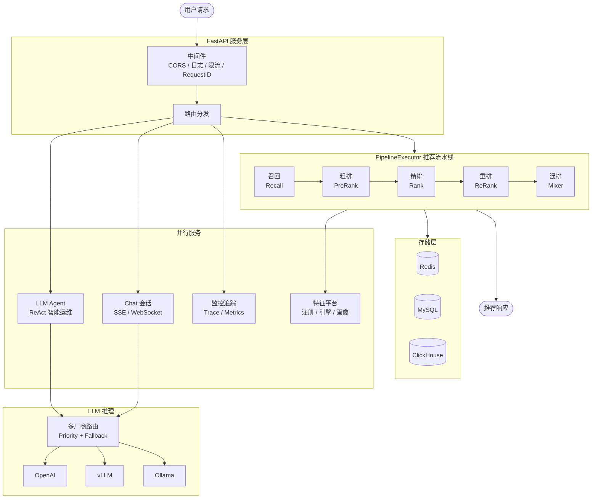

# LLM 推荐系统平台

**LLM 驱动的智能推荐系统运维平台**

---

## 核心特性

| 特性 | 说明 |
|------|------|
| **5 级推荐漏斗** | 召回 → 粗排 → 精排 → 重排 → 混排，配置驱动的多阶段流水线 |
| **LLM 多厂商路由** | OpenAI / vLLM / Ollama 多后端优先级调度，自动故障降级 |
| **ReAct Agent 智能运维** | 自然语言对话控制推荐策略、查询监控指标、诊断系统状态 |
| **全链路追踪** | 每请求 Pipeline Trace，阶段延迟 / 召回覆盖率 / 物品打分明细 |
| **A/B 实验框架** | 配置化实验分流，变体级别参数覆盖，无缝集成推荐链路 |
| **特征平台** | 特征注册中心 + 离线/在线特征引擎 + 用户画像管理 |

## 技术栈

## 系统架构

## 快速导航

| 文档 | 说明 |
|------|------|
| [环境安装](quickstart/installation.md) | 克隆项目、安装依赖、环境变量配置 |
| [第一个请求](quickstart/first-request.md) | 启动服务，发送推荐请求和对话请求 |
| [Docker 部署](quickstart/docker-deploy.md) | 一键启动完整服务栈（含监控） |
| [系统总览](architecture/overview.md) | 高层架构图、模块职责、设计原则 |
| [推荐流水线](architecture/pipeline.md) | 5 级漏斗详解、类图、配置加载机制 |
