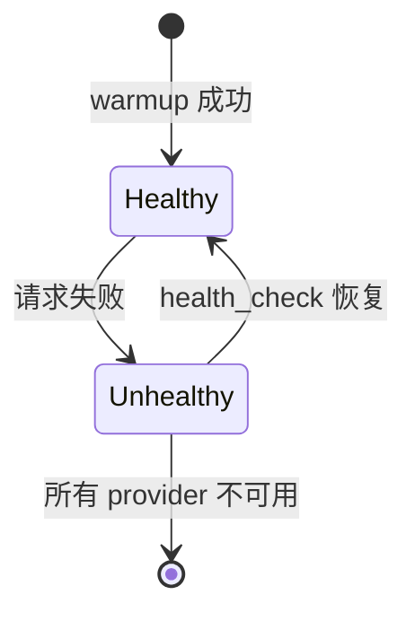

# LLM 多厂商路由器

`LLMRouter` 继承 `LLMBackend`，对下游完全透明。

## 核心机制



- **优先级排序**：按 `priority` 升序（值越小越优先）
- **自动降级**：当前 Provider 失败，自动切换下一个
- **定期恢复**：后台 health check 恢复之前失败的 Provider
- **手动切换**：`select_provider(name)`

## 状态查询

```python
router.get_status()
# → {"active": "ollama", "providers": [{"name": "ollama", "status": "healthy", ...}]}
```

## API

- `GET /api/llm/status` — 查看所有 Provider 状态
- `POST /api/llm/select/{name}` — 手动切换
